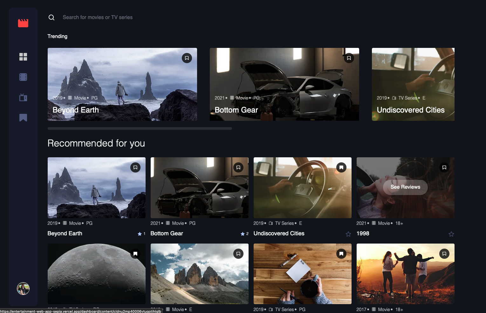
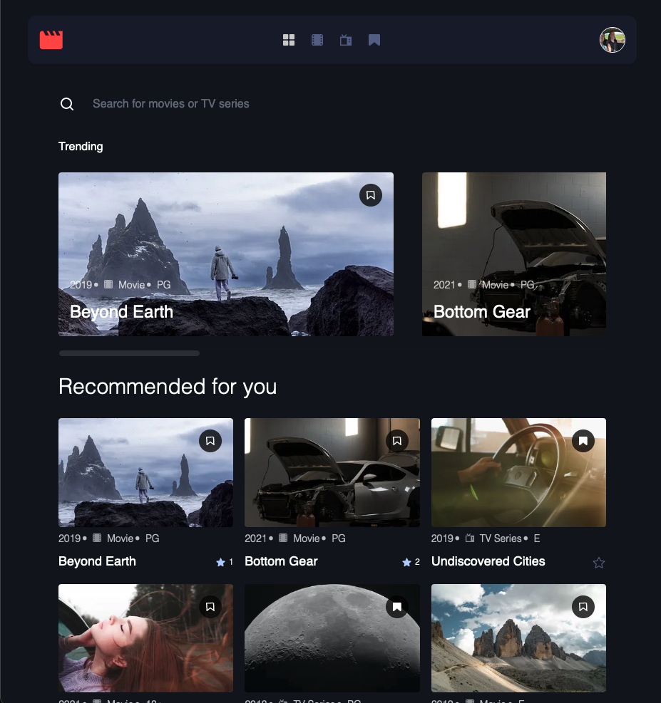
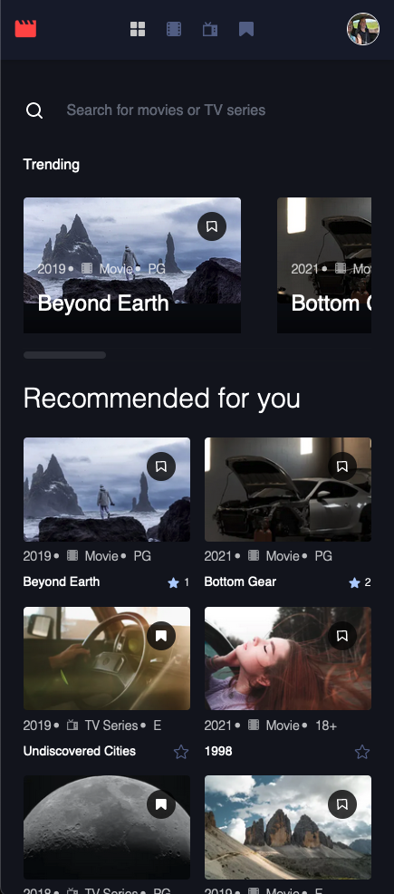

# Frontend Mentor - Entertainment web app solution

This is a solution to the [Entertainment web app challenge on Frontend Mentor](https://www.frontendmentor.io/challenges/entertainment-web-app-J-UhgAW1X). Frontend Mentor challenges help you improve your coding skills by building realistic project.

## Table of contents

- [Overview](#overview)
  - [The challenge](#the-challenge)
  - [Screenshot](#screenshot)
  - [Links](#links)
- [My process](#my-process)
  - [Built with](#built-with)
  - [What I learned](#what-i-learned)
  - [Continued development](#continued-development)
- [Author](#author)
- [Acknowledgments](#acknowledgments)

## Overview

### The challenge

Users should be able to:

- View the optimal layout for the app depending on their device's screen size
- See hover states for all interactive elements on the page
- Navigate between Home, Movies, TV Series, and Bookmarked Shows pages
- Add/Remove bookmarks from all movies and TV series
- Search for relevant shows on all pages
- **Bonus**: Build this project as a full-stack application
- **Bonus**: If you're building a full-stack app, we provide authentication screen (sign-up/login) designs if you'd like to create an auth flow

### Screenshot

### Links

- Solution URL: [GitHub](https://github.com/barnettet31/entertainment-web-app)
- Live Site URL: [Live Site](https://entertainment-web-app-sepia.vercel.app/)

## My process

### Built with

- Semantic HTML5 markup
- CSS custom properties
- Flexbox
- CSS Grid
- Mobile-first workflow
- [React](https://reactjs.org/) - JS library
- [Next.js](https://nextjs.org/) - React framework
- [Tailwind CSS](https://tailwindcss.com/) - For styles
- [Headless UI](https://headlessui.dev/) - For UI components
- [Heroicons](https://heroicons.com/) - For icons
- [Prisma](https://www.prisma.io/) - For database
- [PostgreSQL](https://www.postgresql.org/) - For database
- [TypeScript](https://www.typescriptlang.org/) - For type checking
- [TRPC](https://trpc.io/) - For API
- [React Hook Form](https://react-hook-form.com/) - For form handling
- [React Query](https://react-query.tanstack.com/) - For data fetching
- [Vercel](https://vercel.com/) - For hosting

### What I learned

I learned quite a few things. Firstly, I used this project to familiarize myself with NextJS and NextAuth.

I learned how to use Prisma to map out the tables in a POSTGRESQL database and how to use TRPC to create an API for the database.

I expanded my already existing knowledge React Hook Form to handle form data and how to use React Query to fetch data from the API as this required a more complex usage of these two values.

I expanded my knowledge of Tailwind CSS and more specifically how to customize my tailwind.config.js file to create custom colors, fonts, and spacing.
### Continued development

Moving forward with NextJs my next few projects are going to be using the ability to use server side props to render data from the database. I also plan on using the ability to use server side rendering to create a more SEO friendly website.

I plan on hooking up a larger state library similar to Redux to handle more complex state management, and finally I plan on learning how to use Tailwind to construct my own Design System.

## Author

- Website - [Travis Barnette](https://www.travcodez.com)
- Website - [LinkedIn](https://www.linkedin.com/in/barnettetravis31/)
- Frontend Mentor - [@barnettet31](https://www.frontendmentor.io/profile/barnettet31)
- Twitter - [@TravCodez](https://www.twitter.com/TravCodez)
- YouTube - [@TravCodez](https://www.youtube.com/channel/UCkwVXYkkGf0ej84_wWpSbvg)
## Acknowledgments

Actually I'd like to acknowledge my teacher in the class that I'm taking Romaric Zounlome [Romaric Zounlome](https://www.linkedin.com/in/rzounlom) for pointing me in the direction of Nextjs. He's a great guy with a lot of good intentions for the community in the bootcamp I'm in and I'm glad to have him as a teacher.